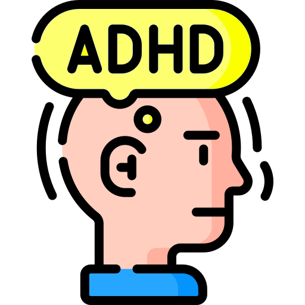

# ADHD Lens for Zotero

<p align="center">
  
</p>

<p align="center">
  <strong>A lightweight reading guide overlay for focused PDF reading in Zotero.</strong>
</p>

<p align="center">
  
  
  
  
  <a href="https://github.com/windingwind/zotero-plugin-template">
    
  </a>
</p>

**ADHD Lens for Zotero** is a lightweight Zotero plugin that adds a movable, resizable, translucent reading guide overlay for focused PDF reading.

It is designed as an accessibility-oriented Zotero extension for people who benefit from visual reading aids, including users with ADHD, attention difficulties, visual tracking fatigue, or anyone reading dense academic PDFs.

> Current target: **Zotero 9**  
> Current status: **experimental prototype**

---

## Download

Download the latest `.xpi` file from the GitHub Releases page:

https://github.com/ObservaGP/adhd-lens/releases/latest

---

## What it does

ADHD Lens adds a visual reading guide to Zotero's PDF reader.

The guide works like a soft, translucent reading bar that can be positioned over the text while reading academic articles, books, reports, and other PDF documents in Zotero.

The plugin currently supports:

- movable reading guide overlay;
- width resizing;
- height resizing;
- color presets;
- size and position presets;
- keyboard shortcuts;
- Zotero Tools menu integration;
- toolbar button integration;
- local per-PDF layout memory;
- PDF-only behavior, so the guide does not appear over Zotero's main library/items list.

---

## Why this plugin exists

Academic PDFs are often visually dense, especially when they use:

- small font sizes;
- narrow margins;
- two-column layouts;
- long paragraphs;
- complex page structures;
- dense theoretical or technical writing.

ADHD Lens was created to support focused academic reading by providing a simple visual guide that helps the reader keep their place on the page.

The project was inspired by screen ruler, reading ruler, and visual focus tools, but adapted specifically for Zotero's PDF reading workflow.

---

## Main features

### Reading guide overlay

- Movable translucent guide
- Resizable width
- Resizable height
- Thin drag handles
- No internal label or text inside the guide
- Designed to stay visually unobtrusive while reading

### Per-PDF layout memory

ADHD Lens can remember the guide layout independently for each PDF.

For each PDF, it can locally remember:

- position;
- width;
- height;
- selected color;
- enabled/disabled state.

This is useful because different PDFs often require different guide positions, especially when switching between one-column and two-column layouts.

### PDF-only behavior

The reading guide is shown only when a Zotero PDF reader tab is active.

It does not appear over Zotero's main library/items list.

### Color presets

The guide currently supports four color presets:

- Yellow
- Blue
- Green
- Gray

### Size and position presets

The plugin includes preset layouts for common reading situations:

- Wide
- Central column
- Left column
- Right column

These presets are useful for one-column and two-column academic PDFs.

---

## Keyboard shortcuts

Some actions can be triggered with keyboard shortcuts.

Shortcut behavior may depend on the operating system, keyboard layout, and Zotero focus state.

| Shortcut | Action |
|---|---|
| `Alt + Shift + G` | Show/hide guide |
| `Alt + Shift + ↑` | Move guide up |
| `Alt + Shift + ↓` | Move guide down |
| `Alt + Shift + ←` | Move guide left |
| `Alt + Shift + →` | Move guide right |
| `Alt + Shift + +` | Increase guide height |
| `Alt + Shift + -` | Decrease guide height |
| `Alt + Shift + 1` | Yellow guide |
| `Alt + Shift + 2` | Blue guide |
| `Alt + Shift + 3` | Green guide |
| `Alt + Shift + 4` | Gray guide |
| `Alt + Shift + Q` | Wide preset |
| `Alt + Shift + W` | Central column preset |
| `Alt + Shift + E` | Left column preset |
| `Alt + Shift + R` | Right column preset |

When shortcuts do not work reliably, use the Zotero menu instead.

---

## Zotero menu

The plugin adds a submenu to Zotero's **Tools** menu:

```text
Tools
└── ADHD Lens
    ├── Show/hide guide
    ├── Colors
    │   ├── Yellow
    │   ├── Blue
    │   ├── Green
    │   └── Gray
    ├── Sizes and positions
    │   ├── Wide
    │   ├── Central column
    │   ├── Left column
    │   └── Right column
    └── Show current tab/document key
```

The diagnostic option **Show current tab/document key** is mainly intended for development and debugging.

---

## Toolbar button

ADHD Lens includes a toolbar button for toggling the reading guide in PDF tabs.

The toolbar button is currently experimental and may change in future releases.

---

## Installation

### From GitHub Releases

1. Go to the latest release page:

   https://github.com/ObservaGP/adhd-lens/releases/latest

2. Download the latest `adhd-lens.xpi` file.

3. In Zotero, open:

   ```text
   Tools → Plugins
   ```

4. Drag the `.xpi` file into the Plugins window.

5. Restart Zotero.

---

## Compatibility

| Application | Status |
|---|---|
| Zotero 9 | Target version |
| Zotero 8 | Not tested |
| Zotero 7 | Not currently targeted |
| Zotero 6 | Not supported |

Tested environment:

- Linux Mint / Ubuntu
- Zotero 9
- Node.js 22
- npm 10

---

## Development setup

Clone the repository:

```bash
git clone https://github.com/ObservaGP/adhd-lens.git
cd adhd-lens
```

Use the Node.js version defined in `.nvmrc`:

```bash
nvm use
```

Install dependencies:

```bash
npm install
```

Build the plugin:

```bash
npm run build
```

The generated `.xpi` file is created inside:

```bash
.scaffold/build/
```

---

## Main source files

The main reading guide logic is implemented in:

```text
src/modules/readingGuide.ts
```

The Zotero lifecycle hook integration is implemented in:

```text
src/hooks.ts
```

The Zotero plugin bootstrap file is:

```text
addon/bootstrap.js
```

This project was initially developed from the Zotero Plugin Template.

---

## Roadmap

Planned or possible improvements:

- improve toolbar button behavior and styling;
- rename remaining internal scaffold/template references, if any;
- add a preferences pane;
- allow users to configure default opacity;
- allow users to configure default color;
- allow users to configure default height;
- allow users to reset the layout for the current PDF;
- improve accessibility options;
- prepare stable GitHub releases with `.xpi` packages;
- archive stable releases on Zenodo;
- add DOI-based citation metadata.

---

## Current limitations

ADHD Lens is still experimental.

Known limitations:

- the toolbar button is still being refined;
- the preferences pane is not complete yet;
- layout memory is local and does not currently sync across devices;
- behavior may vary depending on Zotero version and operating system;
- the plugin currently targets Zotero 9.

---

## How to cite / Como citar

Until a Zenodo DOI is available, please cite the GitHub repository:

> Gianordoli, V., & Lemos Dias, T. (2026). *ADHD Lens for Zotero* (Version 0.1.1) [Computer software]. GitHub. https://github.com/ObservaGP/adhd-lens

Enquanto o DOI do Zenodo não estiver disponível, cite o repositório do GitHub:

> Gianordoli, V., & Lemos Dias, T. (2026). *ADHD Lens for Zotero* (Versão 0.1.1) [Software]. GitHub. https://github.com/ObservaGP/adhd-lens

### BibTeX

```bibtex
@software{gianordoli_lemosdias_adhd_lens_2026,
  author = {Gianordoli, Victor and Lemos Dias, Taciana de},
  title = {ADHD Lens for Zotero},
  version = {0.1.1},
  year = {2026},
  publisher = {GitHub},
  url = {https://github.com/ObservaGP/adhd-lens},
  note = {Zotero plugin for focused PDF reading}
}
```

A Zenodo DOI will be added after the first archived release.

---

## Keywords

Zotero plugin, Zotero addon, Zotero extension, Zotero 9, Zotero PDF reader, PDF reading guide, reading ruler, reading overlay, accessibility, ADHD, focus, academic reading, assistive technology, PDF accessibility.

---

## License

This project is licensed under the **AGPL-3.0-or-later License**.

No warranties are provided.

---

## Acknowledgements

ADHD Lens was initially developed using the Zotero Plugin Template.

The idea was inspired by reading ruler and screen ruler tools, adapted for focused PDF reading inside Zotero.
